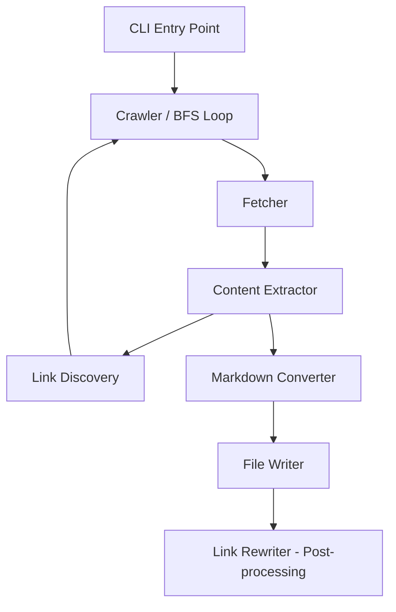

# Design Document: GfG Web Scraper

## Overview

The GfG Web Scraper is a Python CLI application that recursively downloads GeeksforGeeks articles, converts them to Markdown, and organizes them in a numbered, nested directory structure for offline reading. It uses `requests` for HTTP fetching, `BeautifulSoup` (bs4) for HTML parsing and content extraction, and `markdownify` for HTML-to-Markdown conversion.

The scraper starts from a user-provided URL, extracts the main article content (ignoring navigation, ads, sidebars), discovers internal GfG links within that content, and follows them recursively up to a configurable depth. It rewrites internal links to relative local paths, maintains a visited set to prevent cycles, and behaves politely with configurable delays and a browser User-Agent header.

### Key Design Decisions

1. **BFS over DFS**: Breadth-first traversal ensures pages at shallower depths are scraped first, producing a more predictable discovery order and making depth limiting straightforward.
2. **Two-pass link rewriting**: Links are rewritten in a post-processing pass after all pages are scraped, so we know the full set of scraped URLs and their local paths.
3. **markdownify over html2text**: `markdownify` provides better preservation of semantic HTML structures (tables, nested lists, code blocks) and is actively maintained.
4. **Single-threaded with polite delays**: Keeps the implementation simple and server-friendly. No concurrency needed given the polite delay between requests.

## Architecture

The application follows a pipeline architecture with distinct stages: fetch → extract → convert → store, orchestrated by a BFS crawl loop.



### Flow

1. CLI parses arguments and initializes the Crawler with config.
2. Crawler seeds the BFS queue with `(start_url, depth=0)`.
3. For each URL dequeued:
   a. Fetcher makes the HTTP request (with User-Agent, timeout, polite delay).
   b. Extractor parses HTML and isolates Article_Content.
   c. Link Discovery extracts and normalizes internal links from Article_Content.
   d. Converter transforms Article_Content HTML to Markdown.
   e. File Writer saves the Markdown file in the correct directory with numbered filename.
   f. Discovered links (if depth < MAX_DEPTH and not in visited set) are enqueued.
4. After all pages are processed, Link Rewriter does a post-processing pass over all saved Markdown files, rewriting internal GfG URLs to relative local paths where the target was scraped.

## Components and Interfaces

### 1. CLI Module (`cli.py`)

Parses command-line arguments using `argparse`.

```python
def parse_args(argv: list[str] | None = None) -> ScraperConfig:
    """Parse CLI arguments and return a ScraperConfig."""
    ...
```

### 2. ScraperConfig (dataclass)

```python
@dataclass
class ScraperConfig:
    start_url: str
    max_depth: int = 2
    output_dir: str = "output"
    polite_delay: float = 2.0
    request_timeout: float = 30.0
```

### 3. Fetcher (`fetcher.py`)

Handles HTTP requests with polite behavior.

```python
USER_AGENT = "Mozilla/5.0 (Windows NT 10.0; Win64; x64) AppleWebKit/537.36 ..."

def fetch_page(url: str, config: ScraperConfig) -> str | None:
    """
    Fetch a URL and return the HTML content as a string.
    Returns None on error (logs the error).
    Applies polite delay before each request.
    """
    ...
```

### 4. Extractor (`extractor.py`)

Isolates article content from the full page HTML.

```python
def extract_article_content(html: str, url: str) -> BeautifulSoup | None:
    """
    Parse HTML and return a BeautifulSoup tag containing only the article content.
    Returns None if article structure not found (logs warning).
    """
    ...
```

### 5. Link Discovery (`links.py`)

Extracts and normalizes internal links from article content.

```python
def extract_internal_links(article_soup: BeautifulSoup, base_url: str) -> list[str]:
    """
    Extract all internal GfG links from article content.
    Normalizes URLs (removes query params, fragments).
    Filters out external, anchor-only, and non-HTTP(S) links.
    Returns deduplicated list preserving discovery order.
    """
    ...

def normalize_url(url: str) -> str:
    """Remove query parameters and fragments from a URL."""
    ...
```

### 6. Markdown Converter (`converter.py`)

Converts extracted HTML to Markdown.

```python
def convert_to_markdown(article_soup: BeautifulSoup) -> str:
    """
    Convert article HTML to clean Markdown using markdownify.
    Preserves headings, code blocks, lists, tables, bold/italic, images.
    """
    ...
```

### 7. File Writer (`writer.py`)

Manages the output directory structure and file naming.

```python
def build_file_path(
    url: str, parent_dir: str, discovery_order: int
) -> str:
    """
    Build the local file path for a scraped URL.
    Derives filename from URL slug, prepends zero-padded discovery order.
    Creates parent directories as needed.
    Returns the full file path.
    """
    ...

def save_markdown(file_path: str, content: str) -> None:
    """Write Markdown content to the given file path."""
    ...
```

### 8. Link Rewriter (`rewriter.py`)

Post-processes saved Markdown files to rewrite links.

```python
def rewrite_links(
    url_to_filepath: dict[str, str], output_dir: str
) -> None:
    """
    For each saved Markdown file, replace internal GfG URLs
    with relative paths to local files where the target was scraped.
    Retains original URLs for pages not scraped.
    """
    ...
```

### 9. Crawler (`crawler.py`)

Orchestrates the BFS crawl loop.

```python
@dataclass
class CrawlResult:
    pages_scraped: int
    output_dir: str

def crawl(config: ScraperConfig) -> CrawlResult:
    """
    BFS crawl starting from config.start_url.
    Coordinates fetching, extraction, conversion, writing, and link rewriting.
    Returns a CrawlResult summary.
    """
    ...
```


## Data Models

### ScraperConfig

| Field | Type | Default | Description |
|-------|------|---------|-------------|
| `start_url` | `str` | (required) | The seed URL to begin scraping |
| `max_depth` | `int` | `2` | Maximum recursion depth (0 = start page only) |
| `output_dir` | `str` | `"output"` | Root directory for saved files |
| `polite_delay` | `float` | `2.0` | Seconds to wait between requests |
| `request_timeout` | `float` | `30.0` | HTTP request timeout in seconds |

### PageRecord

Tracks metadata for each scraped page during the crawl.

```python
@dataclass
class PageRecord:
    url: str                    # Normalized URL
    depth: int                  # Depth at which this page was discovered
    discovery_order: int        # 1-based order among siblings
    file_path: str              # Local file path where Markdown is saved
    parent_dir: str             # Parent directory for child pages
    child_links: list[str]      # Internal links discovered on this page
```

### CrawlResult

```python
@dataclass
class CrawlResult:
    pages_scraped: int          # Total number of pages successfully saved
    output_dir: str             # Root output directory path
```

### URL-to-FilePath Mapping

A `dict[str, str]` mapping normalized URLs to their local file paths, built during the crawl and used by the link rewriter in the post-processing pass.

### BFS Queue Entry

A tuple `(url: str, depth: int, parent_dir: str, discovery_order: int)` representing a page to be processed.

### Directory Structure Example

For a starting URL with `MAX_DEPTH=2`:

```
output/
├── 01_Articles_On_Computer_Science_Subjects.md    # depth 0
├── 01_Articles_On_Computer_Science_Subjects/      # children dir
│   ├── 01_Data_Structures.md                      # depth 1
│   ├── 01_Data_Structures/                        # children dir
│   │   ├── 01_Arrays.md                           # depth 2
│   │   └── 02_Linked_Lists.md                     # depth 2
│   ├── 02_Algorithms.md                           # depth 1
│   └── 02_Algorithms/
│       ├── 01_Sorting.md                          # depth 2
│       └── 02_Searching.md                        # depth 2
```


## Correctness Properties

*A property is a characteristic or behavior that should hold true across all valid executions of a system — essentially, a formal statement about what the system should do. Properties serve as the bridge between human-readable specifications and machine-verifiable correctness guarantees.*

### Property 1: Article content extraction isolates the article body

*For any* HTML document containing an `<article>` tag (or main content `<div>`), the extractor should return only the content within that tag, and the returned content should not contain any `<nav>`, `<aside>`, `<footer>`, `<header>`, or advertisement-class elements.

**Validates: Requirements 1.1, 1.2**

### Property 2: Markdown conversion preserves semantic structure

*For any* HTML article content containing semantic elements (headings h1-h6, code blocks, unordered/ordered lists, tables, bold, italic, images), the converted Markdown output should contain the corresponding Markdown syntax markers (`#` for headings, triple-backtick or indented blocks for code, `*`/`-` for lists, `|` for tables, `**`/`*` for bold/italic, `` for images).

**Validates: Requirements 2.1, 2.3**

### Property 3: Link filtering only passes valid internal GfG links

*For any* URL found in article content, the link filter should accept it if and only if it uses the HTTP or HTTPS scheme and its domain is `geeksforgeeks.org`. Anchor-only links (`#section`), external domains, `mailto:`, `javascript:`, and other non-HTTP(S) schemes should all be rejected.

**Validates: Requirements 3.2, 3.3**

### Property 4: URL normalization is idempotent and strips query/fragment

*For any* URL string, normalizing it should remove all query parameters and fragment identifiers. Additionally, normalizing an already-normalized URL should produce the same result (idempotence): `normalize(normalize(url)) == normalize(url)`.

**Validates: Requirements 3.4**

### Property 5: Depth limiting prevents link following at MAX_DEPTH

*For any* MAX_DEPTH value and any page discovered at depth equal to MAX_DEPTH, the crawler should save that page's content but should not enqueue any of its child links for processing.

**Validates: Requirements 4.3**

### Property 6: Cycle prevention ensures each unique URL is fetched at most once

*For any* set of pages forming a link graph (including cycles), the crawler should fetch each unique normalized URL exactly once, regardless of how many times it is linked from different pages.

**Validates: Requirements 5.1, 5.2**

### Property 7: Link rewriting correctness

*For any* Markdown file and URL-to-filepath mapping, after link rewriting: every internal GfG URL that exists in the mapping should be replaced with the correct relative file path, and every internal GfG URL that does NOT exist in the mapping should remain as the original absolute URL.

**Validates: Requirements 6.1, 6.2**

### Property 8: Filename generation produces valid numbered slugs with .md extension

*For any* URL path slug and discovery order number, the generated filename should: (a) start with a zero-padded discovery order number, (b) contain only alphanumeric characters and underscores in the slug portion (hyphens and special characters replaced), and (c) end with the `.md` extension.

**Validates: Requirements 2.2, 7.2, 7.3**

## Error Handling

### HTTP Errors

- **Network errors / timeouts**: `requests.exceptions.ConnectionError`, `requests.exceptions.Timeout` — caught in `fetch_page()`, logged with URL and error message, returns `None`. Crawler skips the page and continues.
- **Non-2xx status codes**: Checked after response. Logged with status code and URL. Returns `None`.
- **Timeout configuration**: Each request uses `config.request_timeout` (default 30s).

### Parsing Errors

- **Missing article structure**: `extract_article_content()` returns `None` when `<article>` or main content div is not found. Logs a warning with the URL. Crawler skips conversion/saving for that page.
- **Markdown conversion errors**: Wrapped in try/except. Logged with URL. Page is skipped.

### File System Errors

- **Directory creation**: `os.makedirs(exist_ok=True)` handles race conditions and existing directories.
- **Write failures**: Caught and logged. Crawler continues with remaining pages.

### General Strategy

- All error handling follows the "log and continue" pattern — no single page failure should halt the crawl.
- Errors are logged to stderr using Python's `logging` module at appropriate levels (WARNING for missing content, ERROR for fetch/parse failures).
- The final summary reports total pages successfully scraped, giving the user visibility into any failures.

## Testing Strategy

### Property-Based Testing

Use `hypothesis` as the property-based testing library. Each property test runs a minimum of 100 iterations.

Each property from the Correctness Properties section maps to a single property-based test:

| Property | Test Target | Generator Strategy |
|----------|-------------|-------------------|
| Property 1 | `extract_article_content()` | Generate HTML with random article content + random unwanted elements |
| Property 2 | `convert_to_markdown()` | Generate HTML with random combinations of semantic elements |
| Property 3 | `extract_internal_links()` filter logic | Generate random URLs with various schemes, domains, fragments |
| Property 4 | `normalize_url()` | Generate URLs with random query params and fragments |
| Property 5 | Crawler depth logic | Generate mock page graphs with various depths |
| Property 6 | Crawler visited set logic | Generate mock page graphs with cycles |
| Property 7 | `rewrite_links()` | Generate random URL-to-filepath mappings and Markdown with links |
| Property 8 | `build_file_path()` | Generate random URL slugs and discovery order numbers |

Tag format for each test: `Feature: gfg-web-scraper, Property {N}: {property_text}`

### Unit Testing

Unit tests complement property tests by covering specific examples, edge cases, and integration points:

- **Edge cases**: Empty HTML, HTML with no article tag (Req 1.3), pages with zero internal links, discovery order edge values (0, 1, 99+)
- **Error conditions**: Network timeouts, 404/500 responses, malformed HTML, write permission errors (Req 9.1-9.4)
- **CLI parsing**: Required URL argument, default values for optional args, invalid argument handling (Req 10.1-10.4)
- **Integration**: End-to-end crawl with mocked HTTP responses verifying directory structure, file content, and link rewriting
- **Specific examples**: Known GfG HTML structure extraction, specific URL normalization cases

### Test Configuration

- Framework: `pytest`
- Property testing: `hypothesis` (min 100 examples per property, `@settings(max_examples=100)`)
- Mocking: `unittest.mock` / `responses` library for HTTP mocking
- Coverage target: All public functions in each module
